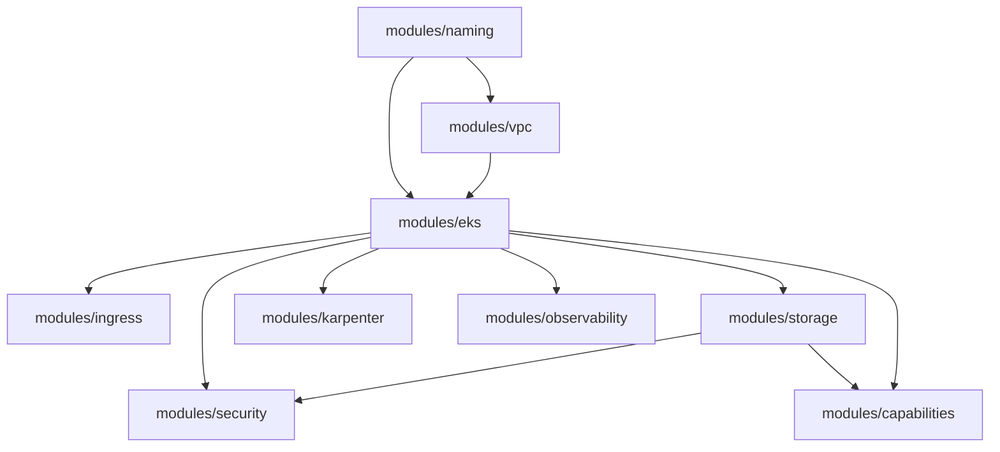

# Terraform Associate (004) and EKS practice

This repository is a clone-and-follow lab for the HashiCorp Certified Terraform Associate (004) exam and a progressive Amazon EKS platform on AWS. Early phases cost nothing. Later phases opt in to a small development cluster. The root module stays thin: you can read every feature flag, and the cloud resources live in modules you can open.

The exam tests Terraform **1.12**. This repo pins **1.12.2**, the last 1.12 patch, through [tfenv](https://github.com/tfutils/tfenv) and `.terraform-version`. Upstream support for 1.12 ended on 19 November 2025. Use 1.12.2 here so your CLI matches the exam. Use a current Terraform release for production work.

## Official exam material

- [Associate (004) study guide](https://developer.hashicorp.com/terraform/tutorials/certification-004/associate-study-004)
- [Exam content list](https://developer.hashicorp.com/terraform/tutorials/certification-004/associate-review-004)

Provider-specific knowledge is not required to pass. The EKS track is here so the same Terraform skills land on a platform you can recognize: VPC, cluster, add-ons, IAM, and state.

## What changed in 004

| Objective | Where you practice it |
| --- | --- |
| 4f `depends_on` and `create_before_destroy` | `labs/03-configuration` (`terraform_data.dependent`) and the S3 bucket resources in `modules/storage` |
| 4g custom conditions and `check` blocks | Variable `validation` blocks, `lifecycle.precondition`, and `check` blocks in labs 03, 07, and 08 |
| 4h ephemeral values and write-only arguments | `labs/03-configuration/ephemeral.tf`. Sensitive values are redacted and still stored. Ephemeral values are not stored. Write-only arguments (`password_wo` plus `password_wo_version`) are how a resource accepts an ephemeral value. Vault belongs in this objective: read the secret at apply time through an ephemeral value so it never lands in state. This repo does not run a Vault server. |
| 8c HCP Terraform projects and workspaces | `labs/06-hcp-terraform/cloud.tf.example` |

## Prerequisites

- git
- [tfenv](https://github.com/tfutils/tfenv)
- An AWS account you can spend a few dollars in, when you reach Phase 2
- AWS CLI v2
- kubectl, for Phases 8B and later
- Helm 3, only if you want to inspect charts outside Terraform. Terraform installs charts itself via the Helm provider.

## Install Terraform with tfenv

From a shell, once per machine:

```bash
git clone --depth=1 https://github.com/tfutils/tfenv.git ~/.tfenv
echo 'export PATH="$HOME/.tfenv/bin:$PATH"' >> ~/.bashrc
export PATH="$HOME/.tfenv/bin:$PATH"
```

From the repository root, every time you start work:

```bash
tfenv install    # reads .terraform-version and installs 1.12.2
tfenv use
terraform version
```

`terraform version` should report `Terraform v1.12.2`. `make version` checks the same thing.

## Authenticate to AWS

No credentials belong in this repository. Do not commit `*.tfvars` with keys, and do not set `access_key` or `secret_key` on the provider.

Pick one method:

```bash
aws sso login --profile learning
export AWS_PROFILE=learning
```

or environment variables for a short-lived session (`AWS_ACCESS_KEY_ID`, `AWS_SECRET_ACCESS_KEY`, `AWS_SESSION_TOKEN`). The AWS provider uses the standard credential chain.

Set `allowed_account_ids` in `terraform.tfvars` when you want Terraform to refuse any other account. The account id is not a secret. It is still worth pinning so a plan cannot land in the wrong account.

Region is `aws_region` (default `us-east-1`). Nothing in the modules hardcodes an account id. Bucket names append the caller account id so they are globally unique.

## Cost and safety

Defaults create nothing in AWS until you opt in.

| Choice | Rough cost | Default |
| --- | --- | --- |
| Phases 1–6 | $0 | on |
| VPC without NAT (Phase 7 or 8A) | $0 hourly for the VPC itself | off until you apply Phase 7 or set `enable_vpc` |
| NAT gateway | about $0.045/hour plus data, plus a public IPv4 address | off, needs `acknowledge_nat_cost` |
| EKS control plane, standard support | about $0.10/hour (~$73/month) | off, needs `acknowledge_eks_cost` |
| EKS extended support | about $0.60/hour | blocked with `upgrade_policy.support_type = STANDARD` |
| One t3.medium node + 20 GiB gp3 | about $0.04/hour plus about $2/month of disk | only with EKS |
| EKS secrets KMS key created by the EKS module | about $1/month | only with EKS |
| Public IPv4 on a node (no-NAT path) | about $0.005/hour | only with EKS and NAT off |
| Karpenter | $0 for the controller, then the price of any instance it launches | off, pool capped at 4 vCPU and t3.small/t3.medium on-demand |
| AWS Load Balancer Controller | $0 until an Ingress or Service creates a load balancer. An ALB is about $0.0225/hour plus LCUs | off |
| VPC Lattice | low while idle; you pay for data processed | off |
| S3 lab bucket | pennies | off |
| EFS | you pay for stored bytes | off |
| CloudWatch logs and Container Insights | ingestion and storage | off, log retention 7 days when enabled |

The managed node group is one `t3.medium` so CoreDNS, the VPC CNI, the Pod Identity agent, and optional controllers fit. Karpenter's NodePool refuses anything except on-demand `t3.small` and `t3.medium`, with a CPU limit of 4. The upstream module example allows very large pools. This repo does not.

Nodes use public subnets when NAT is off, so they can pull images without a NAT gateway. That is a lab tradeoff. Turn NAT on and the node group moves to private subnets.

`enable_cluster_creator_admin_permissions` grants the IAM principal running Terraform cluster admin. Use a personal learning account.

## Learning path

Run the commands from the lab directory. Each lab is its own root module and its own state. `make validate` inits and validates every root.

### Phase 1 — IaC and the core workflow

Directory: `labs/01-hello-workflow`. No AWS. Objectives 1a, 1b, 1c, 3a–3g.

Terraform is infrastructure as code: you describe the desired result, review a plan, and apply the diff. The provider model is how the same workflow reaches more than one cloud. This phase uses the `random` provider so the graph, state file, and commands are real before any cloud bill exists.

```bash
cd labs/01-hello-workflow
terraform init
terraform fmt
terraform validate
terraform plan
terraform apply
terraform destroy
```

### Phase 2 — providers

Directory: `labs/02-providers`. Data sources only. Objectives 2a, 2b, 2c, 2d.

Two `provider "aws"` blocks (default and `alias = "secondary"`) show multi-provider configuration. `terraform init` installs the provider recorded in `.terraform.lock.hcl`.

```bash
cd labs/02-providers
terraform init
terraform fmt
terraform validate
terraform plan
terraform apply
terraform destroy
```

### Phase 3 — configuration

Directory: `labs/03-configuration`. No AWS. Objectives 4a–4h.

Object variables, `for_each`, references, `depends_on`, `create_before_destroy`, preconditions, `check` blocks, a sensitive variable, an ephemeral `random_password`, and comments on write-only arguments.

```bash
cd labs/03-configuration
terraform init
terraform fmt
terraform validate
terraform plan
terraform apply
terraform destroy
```

### Phase 4 — modules

Directory: `labs/04-modules`. No AWS. Objectives 5a, 5b, 5c.

Two calls to `modules/naming` show source paths and variable scope. Registry `version` constraints are commented in that lab and used for real in Phase 8 (objective 5d).

```bash
cd labs/04-modules
terraform init
terraform fmt
terraform validate
terraform plan
terraform apply
terraform destroy
terraform -chdir=../../modules/naming init -backend=false
terraform -chdir=../../modules/naming test
```

### Phase 5 — state and maintenance

Directory: `labs/05-state`. Local state. Objectives 6a–6d, 7a–7c.

`moved` block, `backend.tf.example` (S3 `use_lockfile` and optional DynamoDB), `import.tf.example`, `terraform state list|show`, `terraform plan -refresh-only`, and `TF_LOG`.

```bash
cd labs/05-state
terraform init
terraform fmt
terraform validate
terraform plan
terraform apply
terraform state list
terraform plan -refresh-only
terraform destroy
```

Optional remote backend, after you understand local state:

```bash
cd backend/bootstrap
terraform init
terraform plan
terraform apply
```

The bootstrap root stays on local state on purpose. Copy `labs/05-state/backend.tf.example` into the lab you want to migrate and run `terraform init -migrate-state`.

### Phase 6 — HCP Terraform

Directory: `labs/06-hcp-terraform`. Objectives 8a–8d.

Apply is local. `cloud.tf.example` shows a `cloud` block with a project and a workspace. HCP workspaces are not `terraform workspace` CLI workspaces. Projects group workspaces. Variable sets, policy sets, run tasks, drift detection, the private registry, and dynamic provider credentials are the collaboration and governance features to be able to describe. `terraform login` stores the token outside the repo.

```bash
cd labs/06-hcp-terraform
terraform init
terraform fmt
terraform validate
terraform plan
terraform apply
terraform destroy
```

### Phase 7 — VPC

Directory: `labs/07-vpc`. First optional AWS resources. A VPC with no NAT gateway.

```bash
cd labs/07-vpc
terraform init
terraform fmt
terraform validate
terraform plan
terraform apply
terraform destroy
```

### Phase 8 — EKS platform

Directory: `labs/08-eks-platform`. Flags are documented in that directory's README and in `terraform.tfvars.example`. With no tfvars, plan creates nothing.

```bash
cd labs/08-eks-platform
terraform init
terraform fmt
terraform validate
terraform plan
```

Copy the example tfvars and enable a phase:

```bash
cp terraform.tfvars.example terraform.tfvars
terraform plan
terraform apply
terraform destroy
```

Suggested flag order:

1. `enable_vpc = true`
2. `enable_eks = true` and `acknowledge_eks_cost = true`
3. `enable_alb_controller` and `enable_vpc_lattice`. Add `enable_gateway_controller`, then `create_gateway_class` on a second apply.
4. `enable_s3`, `enable_ebs_csi`, `enable_efs`, `enable_s3_csi`
5. `enable_karpenter` and `acknowledge_karpenter_cost`. Then `manage_karpenter_manifests` on a second apply, after CRDs exist.
6. `enable_network_policy` and `enable_pod_identity_demo`
7. `enable_observability`
8. `enable_capabilities`

After the cluster exists:

```bash
aws eks update-kubeconfig --name tf004-dev-eks --region us-east-1
kubectl get nodes
kubectl get pods -A
```

## Objective map

| Objective | Lab |
| --- | --- |
| 1a Explain what IaC is | Phase 1 |
| 1b Advantages of IaC | Phase 1 |
| 1c Multi-cloud and service-agnostic workflows | Phase 1 (random provider), Phase 2 (AWS provider alias) |
| 2a Install and version providers | Phase 2 lock file, `.terraform-version` |
| 2b How Terraform uses providers | Phase 2 |
| 2c Multiple providers | Phase 2 `alias`, Phase 8 `aws.ecr_public` |
| 2d State | Phase 2 data sources in state, Phase 5 |
| 3a Workflow | Phases 1–8 |
| 3b init | Every phase |
| 3c validate | Every phase, `make validate` |
| 3d plan | Every phase |
| 3e apply | Every phase |
| 3f destroy | Every phase, checklist below |
| 3g fmt | Every phase, `make fmt` |
| 4a resource vs data | Phase 2 data sources, Phase 3 and Phase 7 resources |
| 4b references | Phase 1 outputs, Phase 3 `terraform_data.dependent` |
| 4c variables and outputs | Phase 3, every lab |
| 4d complex types | Phase 3 `topics` map of objects |
| 4e expressions and functions | Phase 3 `for`, `for_each`, `alltrue` |
| 4f depends_on and lifecycle | Phase 3, `modules/storage` |
| 4g custom conditions and checks | Phases 3, 7, 8 |
| 4h sensitive data, ephemeral, write-only, Vault | Phase 3 |
| 5a module sources | Phase 4 local path, Phase 8 Registry |
| 5b variable scope | Phase 4 dev and prod calls |
| 5c use modules | Phases 4, 7, 8 |
| 5d module versions | Phase 8 `version = "~> 21.0"` and `"~> 6.0"` |
| 6a local backend | Default in every lab |
| 6b state locking | `backend/bootstrap` DynamoDB table and S3 `use_lockfile` |
| 6c remote backend | `labs/05-state/backend.tf.example` |
| 6d drift, moved, removed | Phase 5 |
| 7a import | `labs/05-state/import.tf.example` |
| 7b state CLI | Phase 5 |
| 7c TF_LOG | Phase 5 |
| 8a HCP Terraform runs | `labs/06-hcp-terraform` |
| 8b collaboration and governance | `cloud.tf.example` notes |
| 8c projects and workspaces | `cloud.tf.example` |
| 8d CLI integration | `terraform login`, migrate state, remote runs |

## How the EKS topics map into modules

The platform root is `labs/08-eks-platform`. It only wires flags, providers, and module calls.



| Topic | Module | What is actually created when you opt in |
| --- | --- | --- |
| Networking — VPC | `modules/vpc` | `terraform-aws-modules/vpc/aws` `~> 6.0`, two AZs, public and private subnets, Kubernetes ELB tags, `karpenter.sh/discovery` tags, free S3 gateway endpoint. NAT is optional and single-AZ. |
| Networking — VPC CNI | `modules/eks` | Managed add-on `vpc-cni` with `before_compute`, `enableNetworkPolicy` when the security phase asks for it, and a Pod Identity role for `kube-system/aws-node`. The node role keeps `AmazonEKS_CNI_Policy` until you set `attach_cni_policy_to_node_role = false` after the agent is healthy. |
| Networking — AWS Load Balancer Controller | `modules/ingress` | Pod Identity role plus Helm chart `aws-load-balancer-controller` 1.14.1, one replica. No load balancer until you create an Ingress or Service. |
| Networking — VPC Lattice | `modules/ingress` | Service network, VPC association, security group, and ingress from the Lattice managed prefix list. Optional Gateway API controller chart and `amazon-vpc-lattice` GatewayClass. |
| Storage — S3 | `modules/storage` | Encrypted, versioned, non-public bucket, TLS-only policy, `force_destroy` so the lab can be deleted. Optional Mountpoint CSI add-on. A static PV example is in `modules/storage/manifests/s3-static-pv.yaml` and is not applied for you. |
| Storage — EBS | `modules/storage` | `aws-ebs-csi-driver` add-on, Pod Identity for `ebs-csi-controller-sa`, gp3 StorageClass. |
| Storage — EFS | `modules/storage` | Encrypted file system, mount targets, NFS from the node security group, `aws-efs-csi-driver`, Pod Identity, StorageClass. |
| Autoscaling — Karpenter | `modules/karpenter` | `terraform-aws-modules/eks/aws//modules/karpenter` `~> 21.0` for the controller Pod Identity, node role, access entry, and interruption queue. Helm chart 1.6.0. NodePool and EC2NodeClass are opt-in on a second apply. |
| Security — Pod Identity | `modules/eks`, `modules/security`, and each add-on module | `eks-pod-identity-agent` before compute. Demo service account `demo` in namespace `demo` can `s3:GetObject` and `s3:ListBucket` on the lab bucket only. |
| Security — Network policies | `modules/eks` and `modules/security` | CNI flag `enableNetworkPolicy`, plus a default-deny policy and a same-namespace plus DNS allow. |
| Observability | `modules/observability` and the EKS module | Control plane logs when the phase is on. Add-on `amazon-cloudwatch-observability` (CloudWatch agent, Container Insights enhanced observability) with Pod Identity for `amazon-cloudwatch/cloudwatch-agent`. Performance log group retention is 7 days. |
| Automation — EKS capabilities | `modules/capabilities` | `aws_eks_capability` type `ACK`. The IAM role trusts `capabilities.eks.amazonaws.com` and can manage only the lab bucket. Controller logs go to CloudWatch vended logs. `delete_propagation_policy` is `RETAIN`, which is the only value the API accepts: deleting the capability does not delete AWS objects ACK already created. Argo CD capabilities need IAM Identity Center, so this lab does not create one. kro is the same resource with `type = "KRO"` and no AWS permissions. Managed add-ons are the other half of "automation" and are the pieces you will apply most often. |

Patterns borrowed from current AWS and terraform-aws-modules practice (module line 21.x, Pod Identity module 2.9, AWS provider 6):

- Pod Identity instead of IRSA for new controllers
- `vpc-cni` and `eks-pod-identity-agent` installed with `before_compute`
- Karpenter on a small managed node group that it does not own (`karpenter.sh/controller=true`)
- IMDSv2 required (`http_tokens = required`) and hop limit 1, which is viable because pods use Pod Identity rather than IMDS
- One NAT gateway at most, and none by default

## Cleanup checklist

Destroy from the inside out. Karpenter and load balancers create resources Terraform does not track.

1. If Karpenter manifests were applied: `kubectl delete nodepool --all` and `kubectl delete ec2nodeclass --all`. Wait until those nodes are gone.
2. Delete Ingress objects and Services of type LoadBalancer so ALBs and NLBs go away: `kubectl delete ingress --all -A` and check `kubectl get svc -A`.
3. `terraform destroy` in `labs/08-eks-platform`.
4. `terraform destroy` in `labs/07-vpc` if you applied it.
5. If a lab uses the remote backend, migrate it back to local (`terraform init -migrate-state` with the backend block removed) before destroying the bucket.
6. In `backend/bootstrap`, remove `lifecycle { prevent_destroy = true }` from the bucket, empty the bucket, then `terraform destroy`.
7. In the AWS console, confirm these are gone: EKS clusters, EC2 instances, Elastic IPs, NAT gateways, load balancers, EFS file systems, VPC Lattice service networks, CloudWatch log groups, and KMS keys stuck in pending deletion.

## Layout

```
.terraform-version          tfenv pin: 1.12.2
modules/naming               local module and terraform test
modules/vpc                  VPC wrapper
modules/eks                  cluster, core add-ons, CNI Pod Identity
modules/ingress              ALB controller and VPC Lattice
modules/storage              S3, EBS, EFS
modules/karpenter            Karpenter IAM, chart, optional NodePool
modules/security             demo Pod Identity and NetworkPolicy
modules/observability        Container Insights
modules/capabilities         EKS Capability ACK
labs/01-hello-workflow       through labs/08-eks-platform
backend/bootstrap            optional state bucket
```

`make fmt` formats the tree. `make validate` runs `terraform init -backend=false` and `terraform validate` in every root, then `terraform test` on `modules/naming`.

Lock files (`.terraform.lock.hcl`) are committed after `terraform init` so clones do not float provider versions. Re-run `terraform init -upgrade` when you intentionally bump a constraint, and commit the result.
